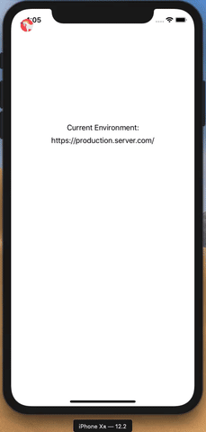

# EnvChanger 🧙‍♂️

[](https://travis-ci.com/scalefocus/EnvChanger)
[](https://cocoapods.org/pods/EnvChanger)
[](https://cocoapods.org/pods/EnvChanger)
[](https://cocoapods.org/pods/EnvChanger)

## About

EnvChanger is a simple tool that helps developers and testers to switch between backend environments really quickly without having to download a specific build.

Displays a button in the top left corner that when selected, presents an alert with the given possible environments
allowing users to easily swap them.

## Preview



## Example

To run the example project, clone the repo, and run `pod install` from the Example directory first.

## Usage 

1. We assume you hold the list of your backend environments in an enum:

```swift
enum Environments: String {
    case production = "https://production.server.com/"
    case staging = "https://staging.server.com/"
    case development = "https://development.server.com"
    case testing = "https://10.0.1.1/"
    case edge = "edge.server.com"
}
```

2. Your enum needs to conform to the `EnvironmentRepresentable` protocol, by implementing `environmentTitle`:

```swift
enum Environments: String, EnvironmentRepresentable {
    case production = "https://production.server.com/"
    case staging = "https://staging.server.com/"
    case development = "https://development.server.com"
    case testing = "https://10.0.1.1/"
    case edge = "edge.server.com"
    
    var environmentTitle: String {
        rawValue
    }
}
```

3. Create an instance of `EnvChangerController` in your AppDelegate `didFinishLaunchingWithOptions`, passing your environment enum:

```swift
var window: UIWindow?

func application(_ application: UIApplication, didFinishLaunchingWithOptions launchOptions: [UIApplication.LaunchOptionsKey: Any]?) -> Bool {
    
    /// Instantiate and pass handler for environment selection.
    let envChanger = EnvChangerController(envs: NetworkService.Environments.self,
                                          window: window) { selectedEnvironment in
        NetworkService.activeEnvironment = selectedEnvironment.environmentTitle
    }
    
    /// If an environment has been saved, set is as the active environment.
    if !envChanger.savedEnvironment.isEmpty {
        NetworkService.activeEnvironment = envChanger.savedEnvironment
    }
    
    return true
}
```

### More Usage

#### Access the saved environment:

```swift
envChanger.savedEnvironment
```
 *Note: The chosen environment is saved in UserDefaults.*

#### Resizes the button with the specified height/width.
```swift
resizeFrame(newWidth: CGFloat, newHeight: CGFloat)  
```  
*Note: If an image is set, the imageEdgeInsets are calculated and set as '(height + width) / 2'.*

#### Additional Notes
- If no button image/title is passed in the constructor, by default it will set the button title to 'EN'.  
- If a button title AND image is specified, the image is implemented and the title set will not be set. 

## Installation

EnvChanger is available through [CocoaPods](https://cocoapods.org). To install
it, simply add the following line to your Podfile:

```ruby
pod 'EnvChanger'
```

## Author

Gavril Tonev, gavril.tonev@upnetix.com   
Teodor Marinov, teodor.marinov@upnetix.com

## License

EnvChanger is available under the [MIT license](LICENSE).

## Contributing

A new version is released by pushing an updated tag to `master`:

```bash
# Make changes, commit files
git tag -a 1.2.3 -m "Release 1.2.3"
git push --follow-tags
```

## TODO

• Implement configurable button style.  
• Implement configurable starting button position.
